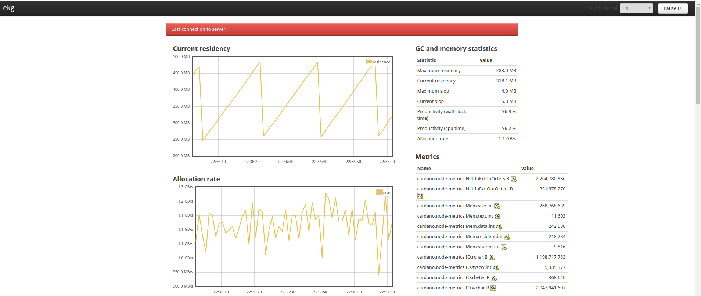

# Monitoring a Node with EKG

This tutorial assumes that you have installed `cardano-node` as explained [here](build.md).

1. For security reasons, EKG can normally only be used to monitor a node
   running on the local machine.
   In order to monitor a node running on an AWS instance, we must work around this.
   We will use port forwarding in this tutorial: When we use Open SSL to connect to our instance,
   we can forward port 8080 on our local machine to port 12788 on the AWS instance as follows:

        ssh -L 8080:127.0.0.1:12788 -i <key-file> ec2-user@<domain>

2. On the AWS instance we change into the `cardano-node` folder again and delete the database-folder and the log-folder:

        cd cardano-node
        rm -rf db
        rm -rf logs

3. When we first started the node, we used the provided script `scripts/mainnet.sh`.
   In order to enable EKG, we will need to tweak the configuration, 
   and for that it is better
   to start the node explicitly and work with our own copy of the configuration files:
    
        cfg=configuration/defaults/mainnet-silent
        cp $cfg/configuration.yaml config.yaml
        cp $cfg/topology.json .
        cp $cfg/genesis.json .

   Now we can start the node at port 8080 with

        cardano-node run \
            --topology topology.json \
            --database-path db \
            --socket-path db/socket \
            --port 8080 \
            --config config.yaml

4. We locate the commented line
    
        # hasEKG: 12788

   in `config.yaml` and uncomment it:

        hasEKG: 12788

   We also uncomment the line

        # - EKGViewBK

   in section `setupBackends`.

        setupBackends:
          - KatipBK
          - EKGViewBK
        # - TraceForwarderBK

   This makes EKG monitoring information available at port 12788
   (you can also change the port to something else if you like, just remember to modify SSH port forwarding accordingly
   in that case).

5. We then restart the node as explained above.

6. On our local machine, we can go to `127.0.0.1:8080` in our browser
   and see the EKG monitoring information.

   
